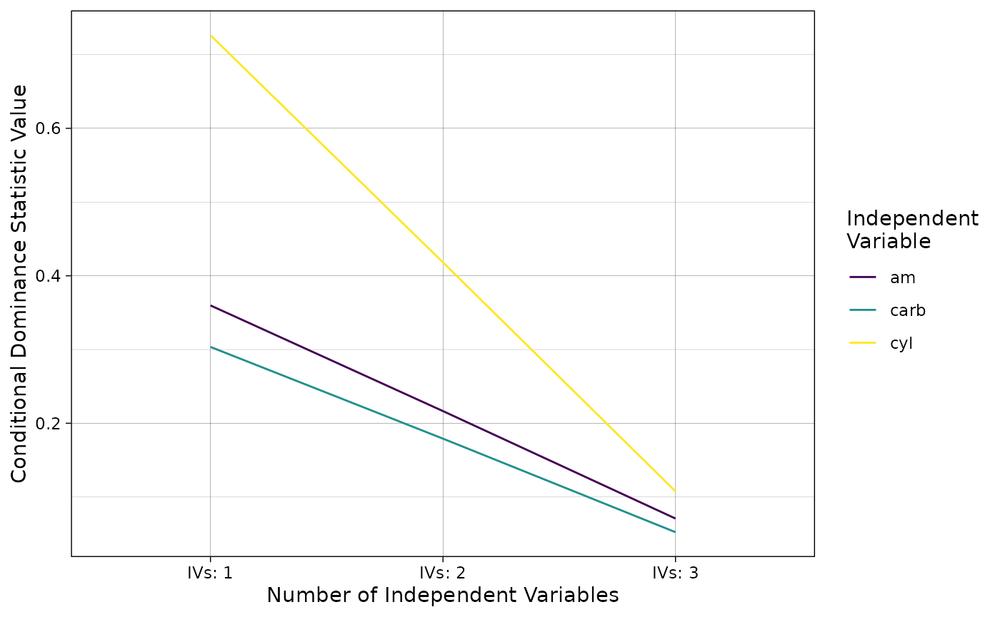

# Conceptual Introduction to Dominance Analysis

The purpose of this vignette is to briefly discuss the conceptual
underpinnings of the relative importance method implemented in the
**domir** package and provide several extensive examples that illustrate
these concepts as applied to data.

This vignette is intended to serve as a refresher for users familiar
with these concepts as well as an brief introduction to them for those
who are not.

By the end of this vignette, the reader should have a sense for what the
key relative importance method is attempting to do as well as an
understanding of how it is accomplished as applied to data.

## Conceptual Introduction

The relative importance method implemented in the **domir** package
produces results that are relatively easy to interpret but does so in a
way that is computationally intensive in as implemented.

The discussion below outlines the conceptual origins of the method, what
the relative importance method does, and some details about how the DA
method is implemented in the **domir** package.

### Dominance Analysis

The focus of the **domir** package is on dominance analysis (DA). DA is
a method that resolves the indeterminacy of trying to ascribe a the
results from a predictive model’s fit metric, referred to as a ‘value’
in the package, to individual predictive factors (i.e., independent
variables/IVs, predictors, features), referred to as ‘names’ in the
package.

A challenge for many predictive models and fit metrics are that there is
no way to analytically decompose the fit statistic/metric given
correlations between the predictive factors that are naturally present
in the data or are introduced by the model. When there is no way to
analytically separate the fit statistic to ascribe it to predictive
factors, a methodological approach could be applied where values are
ascribed by including the factors in the model sequentially. As each
predictive factor is included, the change in the fit metric is ascribed
to that predictive factor.

One issue with the sequential approach is that the sequence chosen to
ascribe the fit statistic to predictive factors determines how much of
the fit statistic is ascribed to the factor. When the analyst has good
reason to choose a specific inclusion order, this approach produces a
useful result.

Using a single inclusion order can be problematic when there is *not* a
good reason to choose one specific inclusion order over another. When
the inclusion order is effectively arbitrary, changing the order changes
the values ascribed to the predictive factors in ways that have
implications on inferences from the model.

A solution to this problem is to consider all possible ways of including
the predictive factor. This method for resolving this issue is the
approach used by Shapley value decomposition from Cooperative Game
Theory (see Grömping (2007) for a discussion) which seeks to find a
solution to the problem of how to subdivide payoffs to players in a
cooperative game based on their relative contribution when it is not
possible to separate relative contributions analytically.

DA uses the idea of comparing across inclusion orders as a
methodological, and almost experimental design-like, approach to
determining importance. DA also extends on the classic Shapley value
decomposition methodology by adding two, more difficult to achieve,
importance criteria. All three different importance criteria, known as
dominance designations, are discussed in greater detail in the context
of an example discussed below after a brief introduction to the `domir`
function.

### DA Implementation with `domir`

The `domir` function is an API for applying DA to predictive modeling
functions in R. The sections below will use this function to illustrate
how DA is implemented and discuss conceptual details of each
computation.

## Concepts in Application

The purpose of the **domir** package is to apply DA to predictive
models. This section builds on the last by providing an example
predictive model with which to illustrate the computation and
interpretation of the dominance results produced by DA.

DA was developed originally using linear regression (`lm`) with the
explained variance $`R^2`$ metric as a fit statistic (Budescu 1993). The
examples below use this model and fit statistic as both are widely used
and understood in statistics and data science.

Consider this model using the *mtcars* data in the **datasets** package.

``` r

library(datasets)

lm_cars <- 
  lm(mpg ~ am + cyl + carb, data = mtcars)

summary(lm_cars)
#> 
#> Call:
#> lm(formula = mpg ~ am + cyl + carb, data = mtcars)
#> 
#> Residuals:
#>     Min      1Q  Median      3Q     Max 
#> -5.8853 -1.1581  0.2646  1.4885  5.4843 
#> 
#> Coefficients:
#>             Estimate Std. Error t value Pr(>|t|)    
#> (Intercept)  32.1731     2.4914  12.914 2.59e-13 ***
#> am            4.2430     1.3094   3.240 0.003074 ** 
#> cyl          -1.7175     0.4298  -3.996 0.000424 ***
#> carb         -1.1304     0.4058  -2.785 0.009481 ** 
#> ---
#> Signif. codes:  0 '***' 0.001 '**' 0.01 '*' 0.05 '.' 0.1 ' ' 1
#> 
#> Residual standard error: 2.755 on 28 degrees of freedom
#> Multiple R-squared:  0.8113, Adjusted R-squared:  0.7911 
#> F-statistic: 40.13 on 3 and 28 DF,  p-value: 2.855e-10
```

The results show that all three IVs are statistically significant at the
traditional level (i.e., $`p < .05`$) and that, in total, the
predictors—*am, cyl*, and *carb*—explain ~80% of the variance in *mpg*.

I intend to conduct a DA on this model using `domir` and implement the
DA as follows:

``` r

library(domir)

domir(
  mpg ~ am + cyl + carb, 
  function(formula) {
    lm_model <- lm(formula, data = mtcars)
    summary(lm_model)[["r.squared"]]
  }
)
#> 
#> Overall Value:      0.8113023 
#> 
#> General Dominance Values:
#>      General Dominance Standardized Ranks
#> am           0.2156848    0.2658501     2
#> cyl          0.4173094    0.5143698     1
#> carb         0.1783081    0.2197801     3
#> 
#> Conditional Dominance Values:
#>      Include At: 1 Include At: 2 Include At: 3
#> am       0.3597989     0.2164938    0.07076149
#> cyl      0.7261800     0.4181185    0.10762967
#> carb     0.3035184     0.1791172    0.05228872
#> 
#> Complete Dominance Proportions:
#>        > am > cyl > carb
#> am >     NA     0      1
#> cyl >     1    NA      1
#> carb >    0     0     NA
```

The `domir` function above prints out results in four sections:

1.  fit statistic results
2.  general dominance statistics
3.  conditional dominance statistics
4.  complete dominance proportions

Below I “replay” and discuss each result in turn.

### Fit Statistic Results

    Overall Value:      0.8113023

The first result `domin` prints is related to the overall fit statistic
value for the model. In game theory terms, this value is the total
payoff all players/IVs produced in the cooperative game/model.

The value produced serves as the fit statistic “to be decomposed” by the
DA and is limiting value for how much each IV will be able to explain.
The DA will ascribe the three IVs in this model separate components of
this ~$`.8113`$ value related to their contributions to predicting
*mpg*.

Other fit statistic value adjustments are reported in this section as
well in particular those associated with the all subsets and constant
model adjustments (*to be discussed further below; sections under
development*) when used in the DA.

### General Dominance Statistics

    General Dominance Values:
         General Dominance Standardized Ranks
    am           0.2156848    0.2658501     2
    cyl          0.4173094    0.5143698     1
    carb         0.1783081    0.2197801     3

The second result printed reports the *general dominance statistics*
related to how the overall fit statistic’s value is divided up among the
IVs. These also represent the Shapley value decompositions of the fit
statistic showing how each player/IV is ascribed a component of the
payoff/fit statistic from the game/model.

The *General Dominance* column of statistics can be interpreted in terms
of the fit metric it decomposed. For example, *am* has a value of
~$`0.2157`$ which means *am* is associated with an $`R^2`$ of about
twenty-two percentage points of *mpg*’s variance given the predictive
model and other IVs.

The *Standardized* column of statistics expresses the general dominance
statistic value as a percentage of the overall fit statistic value and
thus sums to 100%. *am*’s contributions to the $`R^2`$’s total value is
~27% (i.e., $`\frac{.2157}{.8113} = .2659`$).

The final *Ranks* column is most relevant to the focal purpose of
determining the relative importance of the IVs in this model as it
provides a rank ordering of the IVs based on their general dominance
statistics. It is here that DA moves beyond Shapley value decomposition
in that DA, and this rank ordering based on general dominance
statistics, allows for applying labels to the relationships between IVs
in terms of their importance.

*am* is ranked second because it has a smaller general dominance
statistic than the first ranked *cyl*. As such, *am* “is generally
dominated by” *cyl*. By contrast, *am* is ranked higher than third
ranked *carb* and thus *am* “generally dominates” *carb*. These labels
are known as *general dominance designations*.

#### Points of Note: General Dominance

The general dominance statistics always sum to the value of the overall
fit statistic and, because they represent parts of a whole, are widely
considered the easiest of the dominance statistics to interpret (i.e.,
as compared to conditional and complete dominance discussed next).

The general dominance statistics, however simple to interpret, are the
least stringent of the dominance statistics/designations (the reasons
why are discussed later). Thus, the requirements to assign the
“generally dominates” label to a relationship between two IVs are the
easiest to fulfill.

### Conditional Dominance Statistics

    Conditional Dominance Values:
         Include At: 1 Include At: 2 Include At: 3
    am       0.3597989     0.2164938    0.07076149
    cyl      0.7261800     0.4181185    0.10762967
    carb     0.3035184     0.1791172    0.05228872

The third section reported on by `domin` prints the *conditional
dominance statistics* associated with each IV. Each IV has a separate
conditional dominance statistic related to position at which it is
included in the sequence of IVs in the model.

The conditional dominance matrix can be used to designate importance in
a way that is more stringent/harder to achieve than the general
dominance statistics. To determine importance with the conditional
dominance matrix each IV is compared to each other in a ‘row-wise’
fashion. If the value of each entry for a row/IV is greater than the
value of another row/IV at the same position (i.e., comparing IVs at the
same inclusion position) than an IV is said to “conditionally dominate”
the other IV. The matrix above shows that *am* “is conditionally
dominated by” *cyl* as its conditional dominance statistics are smaller
than *cyl*’s at positions 1, 2, and 3. Conversely, *am* “conditionally
dominates” *carb* as its conditional dominance statistics are greater
than *carb*’s at positions 1, 2, and 3.

#### Points of Note: Conditional Dominance

Conditional dominance statistics provide more information about each IV
than general dominance statistics as they more clearly reveal the effect
that IV redundancy has on prediction for each IV. Conditional dominance
statistics show the average increase in predictive usefulness associated
with an IV when it is included at a specific position in the sequence of
IVs. As the position gets more later in the model, the contribution any
one IV can make tends to grow more limited. This limiting effect with
more IVs is reflected in the trajectory of conditional dominance
statistics.

The increase in complexity with conditional dominance over that of
general dominance also results in a more stringent set of comparisons.
Because the label “conditionally dominates” is only ascribed to a
relationship that shows more contribution to the fit metric at all
positions of the conditional dominance matrix, it is a more difficult
criterion to achieve and is therefore a stronger designation.

Note that conditional dominance implies general dominance–but the
reverse is not true. An IV can generally, but not conditionally,
dominate another IV.

### Complete Dominance Proportions

    Complete Dominance Proportions:
           > am > cyl > carb
    am >     NA     0      1
    cyl >     1    NA      1
    carb >    0     0     NA

The fourth section reported on by `domir` prints the *complete dominance
proportions* associated with each IV pair. Each IV is compared to each
other IV and has two entries in this matrix. The IV noted in the row
labels is the ‘dominating’ IV as is implied by the greater than symbol
(i.e., $`>`$) preferring it. The IV noted in the column labels is the
‘dominated’ IV as is implied by the greater than symbol not preferring
it. The values reported are the proportion of sub-models in which the IV
in the row obtains a larger value than the IV in the column.

The complete dominance designations are useful beyond the general and
conditional dominance results as they are the most stringent sets of
comparisons. Complete dominance reflects the relative performance of
each IV to another IV in all the sub-models where their relative
predictive performance can be compared. When a value of 1 is obtained,
the IV in the row is said to “completely dominate” the IV in the column.
Conversely, when a value of 0 is obtained, the IV in the row is said to
be “completely dominated by” the IV in the column.

#### Points of Note: Complete Dominance

Complete dominance designations are the most stringent of the
designations as *all* comparable sub-models for an IV must be larger
than its comparison IV for the “conditionally dominates” label to be
ascribed to their relationship. The sorts of sub-models that qualify as
‘comparable’ is discussed later.

Also note that complete dominance implies both conditional and general
dominance but, again, not the reverse. An IV can conditionally or
generally, but not completely, dominate another IV.

## Dominance Statistics and Designations: Key Computational Details

The DA methodology currently implemented in **domir** is a relatively
assumption-free and model agnostic but computationally expensive
methodology that follows from the way Shapley value decomposition was
originally formulated.

The sections below begin by providing an analogy for how to think about
the computation of DA results, outline exactly how each dominance
statistic and designation is determined, as well as extend the example
above by applying each computation in the context of the example.

### Computational Implementation: All Possible Orders

DA requires evaluating the contribution IVs make to prediction given all
possible orders in which they are included in the prediction model. As
was noted above, this is an experimental design-like approach where all
possible combinations of the IVs included or excluded are estimated as
sub-models. When there are $`p`$ IVs in the model there will be $`2^p`$
sub-models estimated. The experimental design-like approach of the
method makes it widely applicable across predictive models and fit
statistic values but is computationally expensive as each additional IV
added to the model results in a geometric increase in the number of
required sub-models.

### DA Results: The Full-Factorial Design

The DA results related to the `lm` model with three IVs discussed above
is composed of 8 sub-models and their $`R^2`$ values. The `domir`
function, if supplied a predictive modeling function that can record
each sub-model’s results, can be adapted to capture each sub-model’s
$`R^2`$ value along with the IVs that comprise it.

The code below constructs a wrapper function to export results from each
sub-model to an external data frame. The code to produce these results
is complex and each line is commented to note its purpose. This wrapper
function then replaces `lm` in the call to `domir` so that, as the DA is
executed, all the sub-models’ data are captured for the illustration to
come.

``` r

lm_capture <- 
  function(formula, data, ...) { # wrapper program that accepts formula, data, and ellipsis arguments
    count <<- count + 1 # increment counter in enclosing environment
    lm_obj <- lm(formula, data = data, ...) # estimate 'lm' model and save object
    DA_results[count, "formula"] <<- 
      deparse(formula) # record string version of formula passed in 'DA_results' in enclosing environment
    DA_results[count, "R^2"] <<- 
      summary(lm_obj)[["r.squared"]] # record R^2 in 'DA_results' in enclosing environment
    summary(lm_obj)[["r.squared"]] # return R^2
  }

count <- 0 # initialize the count indicating the row in which the results will fill-in

DA_results <- # container data frame in which to record results
  data.frame(formula = rep("", times = 2^3-1), 
             `R^2` = rep(NA, times = 2^3-1), 
             check.names = FALSE)

lm_da <- domir(mpg ~ am + cyl + carb, # implement the DA with the wrapper
               lm_capture, 
               data = mtcars)

DA_results
#>                 formula       R^2
#> 1 mpg ~ am + cyl + carb 0.8113023
#> 2              mpg ~ am 0.3597989
#> 3             mpg ~ cyl 0.7261800
#> 4        mpg ~ am + cyl 0.7590135
#> 5            mpg ~ carb 0.3035184
#> 6       mpg ~ am + carb 0.7036726
#> 7      mpg ~ cyl + carb 0.7405408
```

The printed result from *DA_results* shows that `domir` runs 7
sub-models; each a different combination of the IVs. Note that, by
default, the sub-model where all IVs are excluded is assumed to result
in a fit statistic value of 0 and is not estimated directly (which can
be changed with the `.adj` argument).

The $`R^2`$ values recorded in *DA_results* are used to compute the
dominance statistics and designations reported on above.

#### Complete Dominance Proportions

Complete dominance proportions between two IVs are computed by:

``` math
C_{X_vX_z} =\, \frac{\Sigma^{2^{p-2}}_{j=1}{ \{\begin{matrix} if\, F_{X_v\; \cup\;S_j}\, > F_{X_z\; \cup\;S_j}\, \,then\, 1\, \\ if\, F_{X_v\; \cup\;S_j}\, \le F_{X_z\; \cup\;S_j}\,then\, \,0\end{matrix} }}{2^{p-2}}
```

Where $`X_v`$ and $`X_z`$ are two IVs, $`S_j`$ is a distinct set of the
other IVs in the model not including $`X_v`$ and $`X_z`$ which can
include the null set ($`\emptyset`$) with no other IVs, and $`F`$ is a
model fit statistic. This computation is then the proportion of all
comparable sub-models where $`X_v`$ is greater than $`X_z`$.

The results from *DA_results* can then be used to compute the complete
dominance proportions. The comparison begins with the results for `am`
and `cyl`.

| formula         |   R^2 | formula          |   R^2 |
|:----------------|------:|:-----------------|------:|
| mpg ~ am        | 0.360 | mpg ~ cyl        | 0.726 |
| mpg ~ am + carb | 0.704 | mpg ~ cyl + carb | 0.741 |

Complete Dominance Comparisons: `am` versus `cyl` {.table}

The rows in the table above are aligned such that comparable models are
in the rows. As applied to this example, the $`S_j`$ sets are
$`\emptyset`$ (i.e., the null set) with no other IVs and the set also
including *carb*.

The $`R^2`$ values across the comparable models show that *cyl* has
larger $`R^2`$ values than, and thus completely dominates, *am*.

| formula        |   R^2 | formula          |   R^2 |
|:---------------|------:|:-----------------|------:|
| mpg ~ am       | 0.360 | mpg ~ carb       | 0.304 |
| mpg ~ am + cyl | 0.759 | mpg ~ cyl + carb | 0.741 |

Complete Dominance Comparisons: `am` versus `carb` {.table}

Here the $`S_j`$ sets are, again, $`\emptyset`$ and the set also
including *cyl*.

The $`R^2`$ values across the comparable models show that *am* has
larger $`R^2`$ values than and completely dominates *carb*.

| formula        |   R^2 | formula         |   R^2 |
|:---------------|------:|:----------------|------:|
| mpg ~ cyl      | 0.726 | mpg ~ carb      | 0.304 |
| mpg ~ am + cyl | 0.759 | mpg ~ am + carb | 0.704 |

Complete Dominance Comparisons: `cyl` versus `carb` {.table}

Finally, the $`S_j`$ sets are the $`\emptyset`$ and the set also
including *am*.

The $`R^2`$ values across the comparable models show that *cyl* has
larger $`R^2`$ values than and completely dominates *carb*.

Each of these three sets of comparisons are represented in the
*Complete_Dominance* matrix as a series of proportions. Note that the
diagonal of the matrix is `NA` values as it is conceptually useless to
compare the IV to itself.

``` r

lm_da$Complete_Dominance
#>        >_am >_cyl >_carb
#> am_>     NA     0      1
#> cyl_>     1    NA      1
#> carb_>    0     0     NA
```

#### Computing Conditional Dominance

Conditional dominance statistics are computed as:

``` math
C^i_{X_v} = \Sigma^{\begin{bmatrix}p-1\\i-1\end{bmatrix}}_{i=1}{\frac{F_{X_v\; \cup\; S_i}\, - F_{S_i}}{\begin{bmatrix}p-1\\i-1\end{bmatrix}}}
```

Where $`S_i`$ is a subset of IVs not including $`X_v`$ and
$`\begin{bmatrix}p-1\\i-1\end{bmatrix}`$ is the number of distinct
combinations produced choosing the number of elements in the bottom
value ($`i-1`$) given the number of elements in the top value ($`p-1`$;
i.e., the value produced by `choose(p-1, i-1)`).

In effect, the formula above amounts to an average of the differences
between each model containing $`X_v`$ from the comparable model not
containing it by the number of IVs in the model total. These values then
reflect the effect of including the IV at a specific order in the model.
As applied to the results from *DA_results*, *am*’s conditional
dominance statistics are computed with the following differences:

| formula minuend | R^2 minuend | formula subtrahend | R^2 subtrahend | difference |
|:----------------|------------:|:-------------------|---------------:|-----------:|
| mpg ~ am        |        0.36 | mpg ~ 1            |              0 |       0.36 |

Conditional Dominance Computations: `am` with One IV/Alone {.table
style="width:100%;"}

| formula minuend | R^2 minuend | formula subtrahend | R^2 subtrahend | difference |
|:----------------|------------:|:-------------------|---------------:|-----------:|
| mpg ~ am + cyl  |       0.759 | mpg ~ cyl          |          0.726 |      0.033 |
| mpg ~ am + carb |       0.704 | mpg ~ carb         |          0.304 |      0.400 |

Conditional Dominance Computations: `am` with Two IVs {.table
style="width:100%;"}

| formula minuend | R^2 minuend | formula subtrahend | R^2 subtrahend | difference |
|:---|---:|:---|---:|---:|
| mpg ~ am + cyl + carb | 0.811 | mpg ~ cyl + carb | 0.741 | 0.071 |

Conditional Dominance Computations: `am` with Three IVs/Full Model
{.table}

The rows of each table represent a difference to be recorded for the
conditional dominance statistics computation. In the position one, two,
and three comparison tables, the model with *am* is presented first (as
the minuend) and the comparable model without *am* is presented second
(as the subtrahend)—for the first IV comparison table, this model is the
intercept only model that, as is noted above, is assumed to have a value
of 0. The difference is presented last.

By table, the differences are averaged resulting in the 0.36 value when
first, the
``` r round(lm_da$Conditional_Dominance["am", "``include_at_``2"], digits = 3) ```
when second, and
``` r round(lm_da$Conditional_Dominance["am", "``include_at_``3"], digits = 3) ```
when third.

Next the computations for *cyl* are reported.

| formula minuend | R^2 minuend | formula subtrahend | R^2 subtrahend | difference |
|:----------------|------------:|:-------------------|---------------:|-----------:|
| mpg ~ cyl       |       0.726 | mpg ~ 1            |              0 |      0.726 |

Conditional Dominance Computations: `cyl` with One IV/Alone {.table
style="width:100%;"}

| formula minuend  | R^2 minuend | formula subtrahend | R^2 subtrahend | difference |
|:-----------------|------------:|:-------------------|---------------:|-----------:|
| mpg ~ am + cyl   |       0.759 | mpg ~ am           |          0.360 |      0.399 |
| mpg ~ cyl + carb |       0.741 | mpg ~ carb         |          0.304 |      0.437 |

Conditional Dominance Computations: `cyl` with Two IVs {.table}

| formula minuend | R^2 minuend | formula subtrahend | R^2 subtrahend | difference |
|:---|---:|:---|---:|---:|
| mpg ~ am + cyl + carb | 0.811 | mpg ~ am + carb | 0.704 | 0.108 |

Conditional Dominance Computations: `cyl` with Three IVs/Full Model
{.table}

Again, the differences are averaged resulting in the 0.726 value when
first, the 0.418 when second, and 0.108 when third.

Finally, the computations for *carb*.

| formula minuend | R^2 minuend | formula subtrahend | R^2 subtrahend | difference |
|:----------------|------------:|:-------------------|---------------:|-----------:|
| mpg ~ carb      |       0.304 | mpg ~ 1            |              0 |      0.304 |

Conditional Dominance Computations: `carb` with One IV/Alone {.table
style="width:100%;"}

| formula minuend  | R^2 minuend | formula subtrahend | R^2 subtrahend | difference |
|:-----------------|------------:|:-------------------|---------------:|-----------:|
| mpg ~ am + carb  |       0.704 | mpg ~ am           |          0.360 |      0.344 |
| mpg ~ cyl + carb |       0.741 | mpg ~ cyl          |          0.726 |      0.014 |

Conditional Dominance Computations: `carb` with Two IVs {.table}

| formula minuend | R^2 minuend | formula subtrahend | R^2 subtrahend | difference |
|:---|---:|:---|---:|---:|
| mpg ~ am + cyl + carb | 0.811 | mpg ~ am + cyl | 0.759 | 0.052 |

Conditional Dominance Computations: `carb` with Three IVs/Full Model
{.table}

And again, the differences are averaged resulting in the 0.304 value
when first, the 0.179 when second, and 0.052 when third.

These nine values then populate the conditional dominance statistic
matrix.

``` r

lm_da$Conditional_Dominance
#>      include_at_1 include_at_2 include_at_3
#> am      0.3597989    0.2164938   0.07076149
#> cyl     0.7261800    0.4181185   0.10762967
#> carb    0.3035184    0.1791172   0.05228872
```

The conditional dominance matrix’s values can then be compared by
creating a series of logical designations indicating whether each IV
conditionally dominates each other.

Below the comparisons begin with *am* and *cyl*

|              |    am |   cyl | comparison |
|:-------------|------:|------:|:-----------|
| include_at_1 | 0.360 | 0.726 | FALSE      |
| include_at_2 | 0.216 | 0.418 | FALSE      |
| include_at_3 | 0.071 | 0.108 | FALSE      |

Conditional Dominance Designation: `am` Compared to `cyl` {.table}

The table above is a transpose of the conditional dominance statistic
matrix with an additional *comparison* column indicating whether the
first IV/*am*’s conditional dominance statistic at that inclusion
position is greater than the second IV/*cyl*’s at that same position.

Conditional dominance is determined by all values being `TRUE` or
`FALSE`; in this case, *cyl* is seen to conditionally dominate *am* as
all values are `FALSE`.

Next is the comparison between *am* and *carb*

|              |    am |  carb | comparison |
|:-------------|------:|------:|:-----------|
| include_at_1 | 0.360 | 0.304 | TRUE       |
| include_at_2 | 0.216 | 0.179 | TRUE       |
| include_at_3 | 0.071 | 0.052 | TRUE       |

Conditional Dominance Designation: `am` Compared to `carb` {.table}

Here *am* conditionally dominates *carb* as all values are `TRUE`.

The final comparison between *cyl* and *carb*

|              |   cyl |  carb | comparison |
|:-------------|------:|------:|:-----------|
| include_at_1 | 0.726 | 0.304 | TRUE       |
| include_at_2 | 0.418 | 0.179 | TRUE       |
| include_at_3 | 0.108 | 0.052 | TRUE       |

Conditional Dominance Designation: `cyl` Compared to `carb` {.table}

*cyl* also conditionally dominates *carb* as all values are `TRUE`.

Another way of looking at conditional dominance is by graphing the
trajectory of each IV across all positions in the conditional dominance
matrix. If an IV’s line crosses another IV’s line, then a conditional
dominance relationship between those two IVs cannot be determined. A
graphic depicting the trajectory of the three IVs in the focal model is
depicted below.



The graph above confirms that all three IV’s lines never cross and thus
have a clear set of conditional dominance designations.

As was mentioned in the **Concepts in Application** section, because we
knew all three IVs have complete dominance designations relative to one
another, they necessarily also had conditional dominance designations
relative to one another.

#### Computing General Dominance

General dominance is computed as:

``` math
C_{X_v} = \Sigma^p_{i=1}{\frac{C^i_{X_v}}{p}}
```

Where, $`C^{i}_{X_x}`$ are the conditional dominance statistics for
$`X_v`$ with $`i`$ IVs. Hence, the general dominance statistics are the
arithmetic average of all the conditional dominance statistics for an
IV.

When applied to *am*’s results, the general dominance statistic value
is:

| include_at_1 | include_at_2 | include_at_3 | general dominance |
|-------------:|-------------:|-------------:|------------------:|
|         0.36 |        0.216 |        0.071 |             0.216 |

General Dominance Computations: `am` {.table}

Next to *cyl*.

| include_at_1 | include_at_2 | include_at_3 | general dominance |
|-------------:|-------------:|-------------:|------------------:|
|        0.726 |        0.418 |        0.108 |             0.417 |

General Dominance Computations: `cyl` {.table}

And lastly *carb*.

| include_at_1 | include_at_2 | include_at_3 | general dominance |
|-------------:|-------------:|-------------:|------------------:|
|        0.304 |        0.179 |        0.052 |             0.178 |

General Dominance Computations: `carb` {.table}

Taken as a set, these values represent the general dominance
statistic/Shapley value decomposition vector:

``` r

lm_da$General_Dominance
#>        am       cyl      carb 
#> 0.2156848 0.4173094 0.1783081
```

The general dominance statistic vector can also be used in a way similar
to that of the complete and conditional dominance designations by
ranking each value.

| IV   | general dominance | ranks |
|:-----|------------------:|------:|
| am   |             0.216 |     2 |
| cyl  |             0.417 |     1 |
| carb |             0.178 |     3 |

General Dominance Designations {.table}

The rank ordering above shows that *am* is generally dominated by *cyl*,
*am* generally dominates *carb*, and *cyl* also generally dominates
*carb*.

Again because we knew all three IVs have complete and conditional
dominance designations relative to one another, they necessarily also
had general dominance designations relative to one another.

##### General Dominance/Shapley Values: Weighted Average of All Submodels

It is also worth pointing out a subtle feature of the general dominance
statistics that tends to be more explicit discussions about the Shapley
value decomposition. This feature is that each general dominance
statistic is a weighted average of **all** $`2^p`$ fit statistics.

To see how this is the case, first recall the computations related to
obtaining conditional dominance statistics for the *am* IV. If you look
at all the entries in the three tables, all 8 models are included either
as a minuend or a subtrahend. The general dominance statistics are then
just an average of these three conditional dominance statistics. Hence,
the general dominance statistics include the value for **every** model.

The conditional dominance statistics for *cyl* and *carb* re-arrange
these same models but otherwise use the same information to produce
their general dominance statistics.

### Strongest Dominance Designations

Whereas all dominance designations have been made in the example above,
the strongest designation between two IVs is likely of primary interest
as the strongest designation, as is noted above, implies all weaker
designations.

To access the strongest dominance designations, the DA object can be
submitted to the `summary` function.

``` r

summary(lm_da)$Strongest_Dominance
#>                                                                            
#>  "am"                         "am"                   "cyl"                 
#>  "is completely dominated by" "completely dominates" "completely dominates"
#>  "cyl"                        "carb"                 "carb"
```

The result the `summary` function produces in the *Strongest_Dominance*
element is consistent with expectation in that all three IV
interrelationships have complete dominance designations between them.

## Parting Thoughts

“Relative importance” as a concept is used in many different ways in
statistics and data science. In the author’s view, a crucial, but rarely
acknowledged, difference between DA and many of the relative importance
statistics produced by methods other than DA, are that many other
methods are probably most useful for model selection and not for model
evaluation. In making a distinction between model selection and
importance, I follow the work of Azen et al. (2001) who distinguish
between the concept of IV criticality and IV importance.

### Criticality: Model Selection

In many cases, methods that focus on relative importance are probably
best used for model selection. When applied to model selection, a method
would identify when an IV should be included in the model or not. The
process of determining whether or not an IV should be included in the
model is described by Azen et al. as reflecting *IV Criticality*.

In the view of the author, methods such as posterior inclusion
probability, Akaike weights, and permutation importance are actually IV
criticality, as opposed to importance, measures. These methods are
criticality methods as they tend to be informative for identifying
whether an IV has trivial or non-trivial contribution to prediction but
is less informative for identifying the magnitude of their contribution.

### Importance: Model Evaluation

Model evaluation differs from model selection in that it seeks not to
determine whether IVs should be in the model, but rather compares them
in terms of their impact in the model conditional on their being
included. Thus, importance methods assume that a model has passed
through a model selection phase and that all the predictors in the model
have non-trivial effects.

The DA method implemented by the `domir` function is an importance
method in this sense in that it assumes that the predictive model used
is “pre-selected” or has passed through model selection procedures and
the user is confident that the IVs model and are, in fact, reasonable to
include. The results from DA and similar methods then provide more
information about relative contribution to prediction which assists in
model evaluation.

Azen, Razia, David V Budescu, and Benjamin Reiser. 2001. “Criticality of
Predictors in Multiple Regression.” *British Journal of Mathematical and
Statistical Psychology* 54 (2): 201–25.
<https://doi.org/10.1348/000711001159483>.

Budescu, David V. 1993. “Dominance Analysis: A New Approach to the
Problem of Relative Importance of Predictors in Multiple Regression.”
*Psychological Bulletin* 114 (3): 542–51.
<https://doi.org/10.1037/0033-2909.114.3.542>.

Grömping, Ulrike. 2007. “Estimators of Relative Importance in Linear
Regression Based on Variance Decomposition.” *The American Statistician*
61 (2): 139–47. <https://doi.org/10.1198/000313007X188252>.
